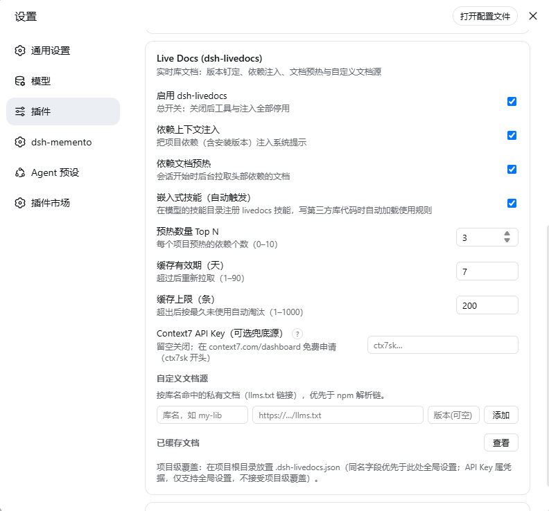
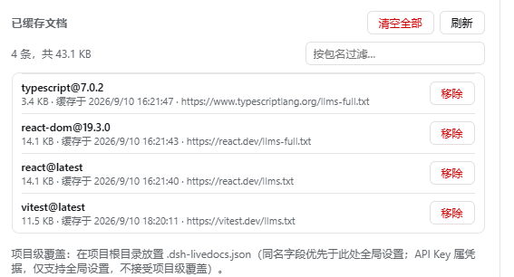
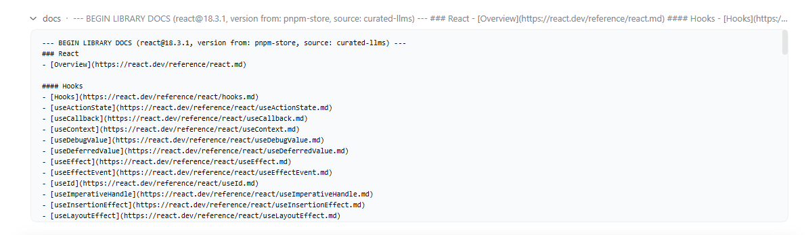

# dsh-livedocs

[](LICENSE)
[](https://www.npmjs.com/package/dsh-livedocs)
[](https://github.com/deepseek-ai/deepseek-harness)
[](https://llmstxt.org)

Version-pinned live library docs for **DeepSeek Harness (DSH)** — kill hallucinated APIs.

在 agent 写代码前，拉取**版本对应**的官方文档注入上下文：llms.txt 优先、GitHub tag 文档兜底、本地缓存离线可用、token 预算可控。装好即注册嵌入式技能自动触发，零配置、零 API Key（可选 Context7 云端兜底）。

## 安装

```bash
# npm（推荐，包名即插件名）
dsh plugin --profile web add dsh-livedocs

# 或从 GitHub 安装
dsh plugin --profile web add github:sogoodayo/dsh-livedocs
```

## 用法

三种方式，按无感程度排列：

**0. 嵌入式技能（零配置，装好即生效）**——插件向宿主的技能注册表登记了 `livedocs` 技能：模型目录里常驻一条约 30 token 的路由描述，一旦任务涉及第三方库（写代码、修 bug、问用法），模型会自动加载完整使用规则并按规则先查文档。可在设置卡片用「嵌入式技能」开关关闭。

**1. 斜杠命令（手动，最直接）**——在输入框敲 `/` 即可看到：

```
/livedocs react hooks
/livedocs next routing
```

结果直接渲染在会话里，**不消耗模型 token**。

**2. 全局自动规则（推荐，装一次处处生效）**——让 agent 跑一次：

```
用 docs_setup 装一下全局规则（scope 传 global）
```

规则写入 `~/.dsh/AGENTS.md`，DSH 内置的指令组件会把它注入**所有项目的所有会话**，agent 写第三方库代码前会主动先查文档。

**3. 模型自动选择**——工具描述中已内置"写第三方库代码前必须先查"的引导，模型在编码任务中会自行调用。

## 工具

| 工具 | 说明 |
|---|---|
| `docs_resolve` | 库名 → 文档源（文档站 llms.txt、GitHub 仓库、最新版本） |
| `docs_query` | 拉取版本对应的文档片段，按 topic 检索、按 token 预算裁剪，7 天本地缓存；传 `projectDir` 自动钉项目里安装的版本 |
| `docs_cache` | 缓存统计 / 清理 |
| `docs_setup` | 把使用规则幂等写入 AGENTS.md（`scope: project` 项目级 / `scope: global` 全局） |

## 截图

| 设置卡片（全部配置可视化） | 缓存文档管理 | `/livedocs` 斜杠命令 |
|---|---|---|
|  |  |  |

## 工作原理

```
库名 → npm registry 元数据（版本 / 仓库 / 文档站）
     → 版本钉选：显式 version > node_modules / lockfile 实测 > 最新 release
     → 拉取链：llms-full.txt → llms.txt → GitHub README（按 tag 钉版本）
     → 可选兜底：配置 Context7 API Key 后，长尾库回退到 Context7 云端索引（支持版本钉定，401/429 显式报错）
     → 版本不一致时输出显式警告（llms.txt 永远是最新版的文档）
     → Markdown 按标题分块 → topic 打分（零命中自动回退概览）→ token 预算内裁剪
     → JSON 文件 LRU 缓存（断网时返回过期缓存并标注 stale）
```

## 手动规则（可选）

不想跑 `docs_setup` 的话，手动在 AGENTS.md 中加一条：

```text
Always call docs_query before writing code against any third-party library API.
Never rely on training data for framework APIs (Next.js, React, Vue, etc.).
```

## 路线图

- [x] M1：三工具 + 多源降级 + 缓存
- [x] M2：读项目 node_modules / lockfile 自动钉版本；`docs_setup` 规则幂等注入 AGENTS.md
- [x] M2.5：`/livedocs` 斜杠命令；全局规则；版本不一致警告；topic 零命中回退
- [x] M2.6：依赖上下文注入（每会话自动向模型展示项目依赖及安装版本）+ Top 3 依赖文档后台预热
- [x] M3：设置卡片（设置 → 插件 → 插件配置 → Live Docs）：总开关、注入/预热开关、预热 Top N、缓存 TTL 与上限、自定义文档源（customDocs）、缓存列表查看/移除/清空；项目级 `.dsh-livedocs.json` 覆盖
- [x] M3.7：策展注册表（50+ 主流库，verified llms.txt 源直连）+ 预热拉满 N 个（失败不占名额，注册表命中插队）+ 出错后查文档规则；缓存迁至 `~/.dsh/livedocs/`（跨 profile 共享，插件升级不清零）
- [x] M4：可选 Context7 云端索引兜底（设置卡片填 Key 即启用，默认关闭；版本钉定 + 401/429 显式报错；Key 仅全局设置，项目文件不可覆盖）
- [x] M5：嵌入式 skill 自动触发（`ctx.skills` 运行时注册 `livedocs` 技能，目录描述常驻、正文按需加载；设置卡片可关；与总开关联动）
- [x] M6：设置卡片「检查更新」：Host 侧查询 npm registry 最新发布并对比运行版本，发现新版本时给出升级命令
- [x] M7：设置卡片中英双语切换（`locale: zh/en`，默认中文，即时生效）

## 兼容性

已在 DSH Developer Preview（web profile）的插件契约下开发：`inject: ['tools']` + `defineTool`（`@deepseek-ai/dsh-tools`）。DSH 处于预览期，若宿主升级导致 inject 契约变化，请提 issue。

设计与调研依据见 [docs/feasibility.md](docs/feasibility.md)。

## License

MIT
